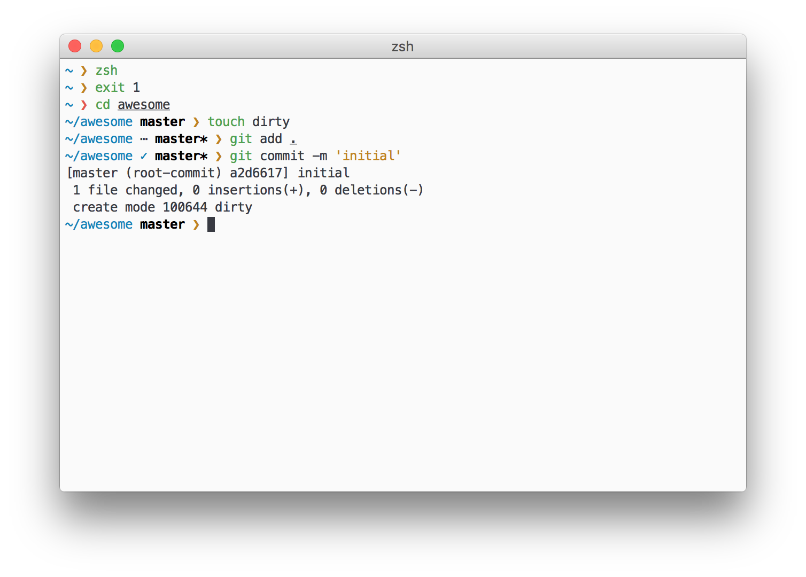

# neat

> Minimal zsh prompt inspired by [odin][odin] and [pure][pure]



## Install

Clone this repo and append next line to your `.zshrc`:

```zsh
source neat/neat.zsh
```

## Indicators

Prompt git indicators:

* `⋯` — untracked files
* `✓` — files added
* `⚑` — modified files
* `✖` — deleted files
* `➜` — renamed files
* `‼` — unmerged files
* `↑` — repo is ahead of current branch
* `↓` — repo is behind

Discharged battery indicator — `⚡`

## License

MIT

[odin]: https://github.com/tylerreckart/Odin
[pure]: https://github.com/sindresorhus/pure
